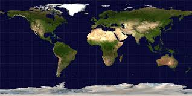
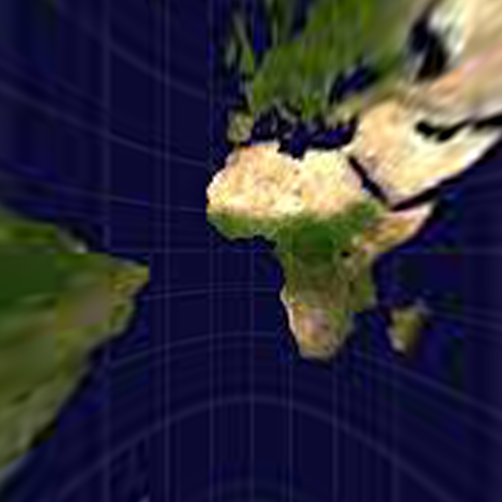
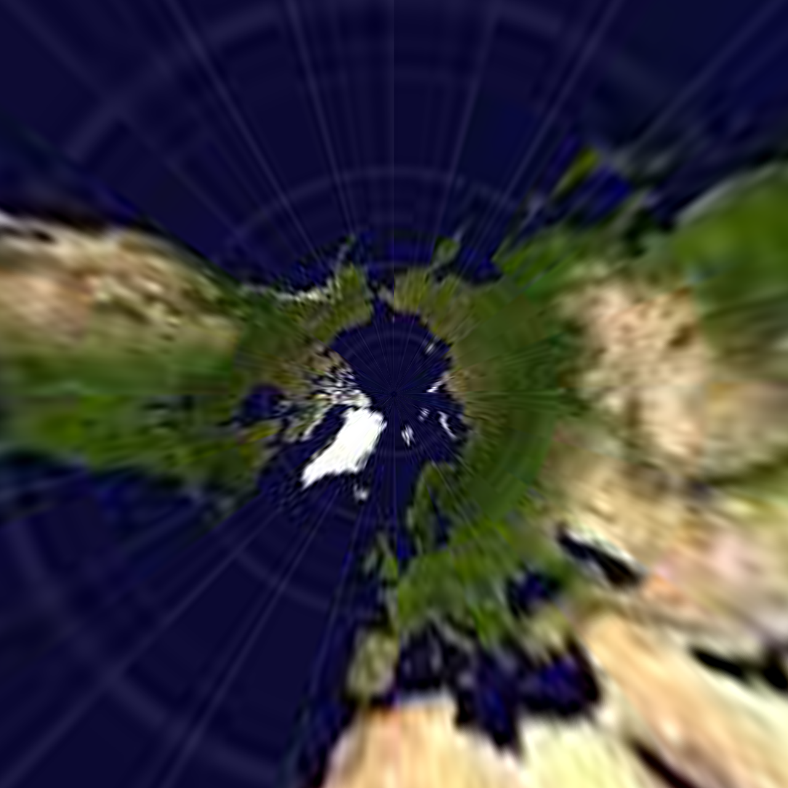
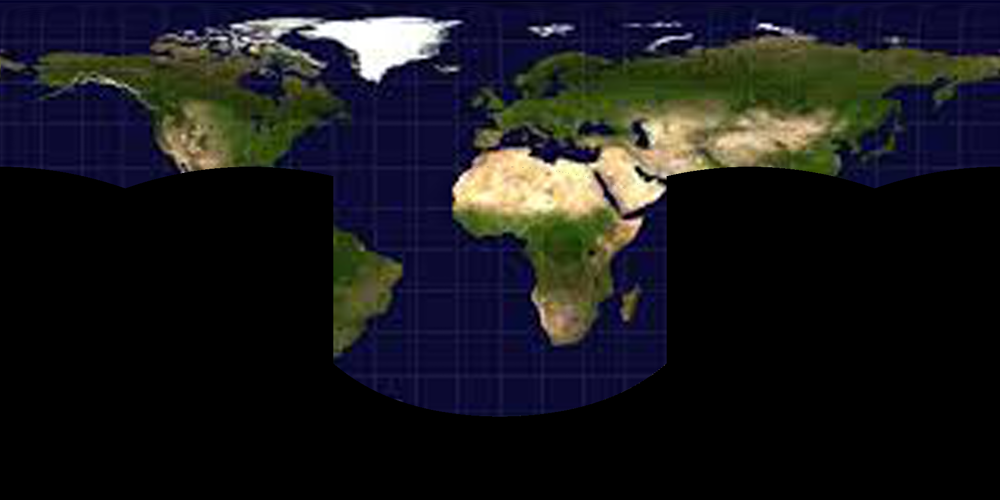
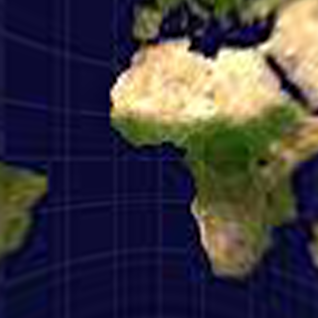
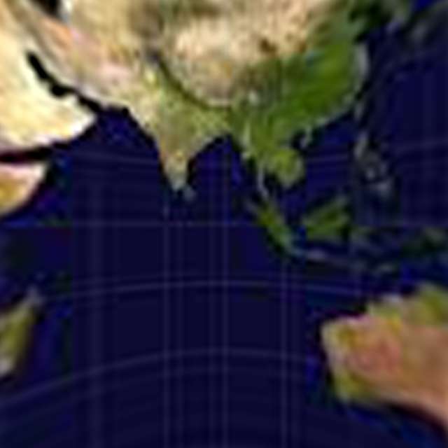
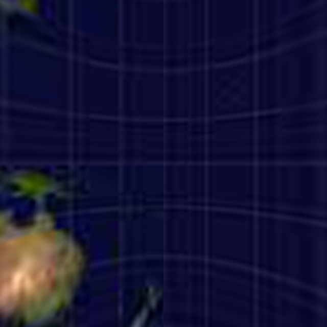
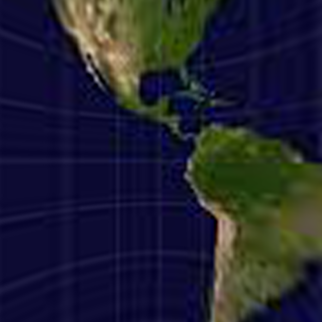
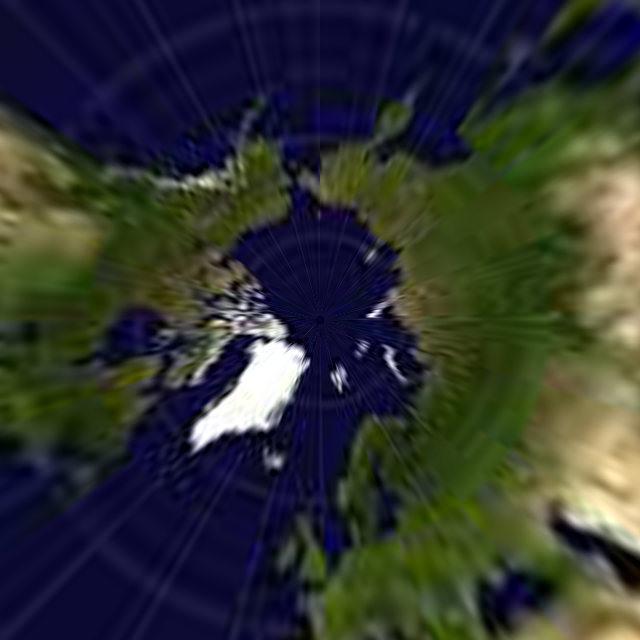
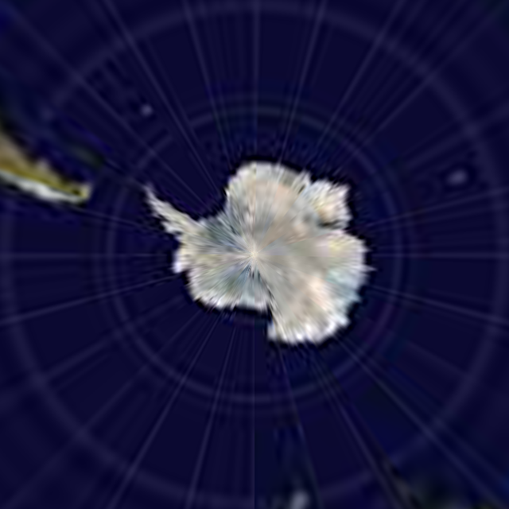

# Perspective and Equirectangular
## Introduction
<strong> Perspective2Equirectangular </strong> is a python code to help you transfer image between equirectangular and perspective. Four transfer is in the list.


1.  equirectangular to perspective.
2.  perspective to equirectangular. 
3.  equirectangular to cube.  
4.  cube to equirectangular.

## Equirectangular to Perspective
Given an input of 360 degree panorama
<center></center>
Setting the (FOV, theta, phi, height, width) in the code <strong>equir2pers.py</strong>

```
equ = E2P.Equirectangular(input_img)    # Load equirectangular image
img = equ.GetPerspective(120, 0, 0, 1280, 1280)  # Specify parameters(FOV, theta, phi, height, width)
output1 = output_dir +  '/perspective_1.png'
cv2.imwrite(output1, img)
```
**Run:**  ```python equir2pers.py```.

<center></center>

## Perspective to Equirectangular
Given multiple perspective images and infromation(FOV, theta, phi, height, width).  
If the equirectangle image is overlapping, the pixel calculate the average in multiple image.

   
Setting the image information (FOV, theta, phi) in the code <strong>pers2equir.py</strong>.

```
input1 = input_dir + '/perspective_1.png'
input2 = input_dir + '/perspective_2.png'

equ = m_P2E.Perspective([input1,input2],
                        [[120, 0, 0],[120, 0, 90]])   #[FOV,theta,phi]
img = equ.GetEquirec(height,width)
```
**Run:**  ```python pers2equir.py```.
<center></center>

## Panorama to Cube
Put image in `./panorama`.   
<center></center>

**Run:**  ```python panorama2cube.py```.   
    
  

## Cube to Panorama
Put image in `./in_path`.  
If you do not want to change code, remeber to set the image name (front,right,black,left,top,bottom).png. 

**Run:**  ```python panorama2cube.py --mode cube --input ./in_path --output ./out_path```.

<center></center>


